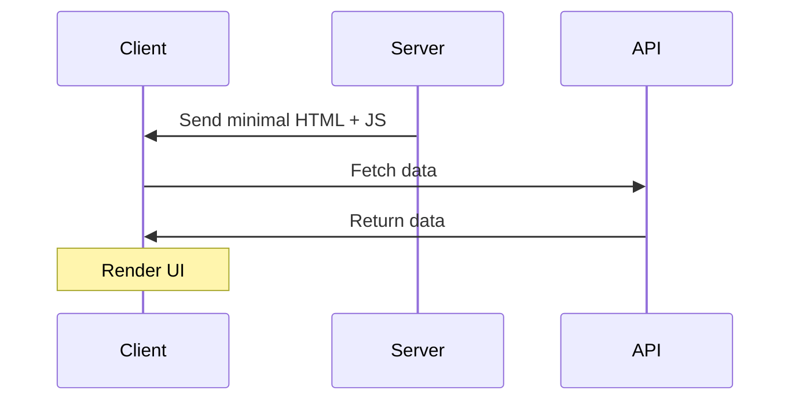
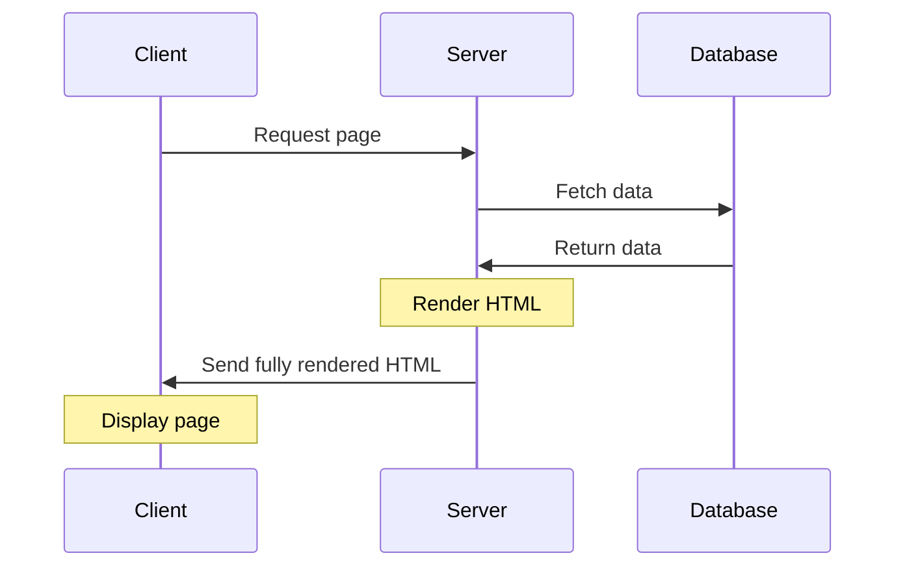

# Lesson 3 - CSR vs SSR

## What is CSR?

Client-Side Rendering (CSR) is a web application architecture where the client (browser) is responsible for rendering the UI. The server sends the client a minimal HTML page and JavaScript bundle. The client then uses JavaScript to fetch data and render the UI.

### Pros of CSR

- Fast initial page load (though subsequent data fetches may be slower)
- Rich user interactions
- Great for single-page applications (SPAs)

### Cons of CSR

- Poor SEO (Search Engine Optimization)
- Slower time to interactive, especially on low-end devices
- Poor performance on slow networks
- Increased client-side complexity

## What is SSR?

Server-Side Rendering (SSR) is a web application architecture where the server is responsible for rendering the UI. The server sends the client a fully rendered HTML page, which the browser can display immediately.

### Pros of SSR

- Excellent for SEO
- Faster time to first meaningful paint
- Better performance on low-end devices and slow networks
- Direct access to server and database
- More secure handling of environment variables

### Cons of SSR

- Potentially slower full page load times
- Higher server load
- More complex server-side setup
- Potentially less rich user interactions without additional client-side JavaScript

## Hybrid Approaches

Some frameworks like Next.js and Gatsby allow for a hybrid approach, combining elements of both CSR and SSR:

1. **Hybrid Rendering**: Allows both server and client-side components in the same application.
2. **Static Site Generation (SSG)**: Pre-renders pages at build time, combining the benefits of static sites with dynamic capabilities.

These approaches aim to provide the best of both worlds, optimizing for performance and SEO while maintaining rich interactivity.

## When to Use CSR vs SSR

- Use CSR for:
  - Highly interactive applications (e.g., web-based tools, admin dashboards)
  - Applications where SEO is less critical
  - When targeting users with primarily high-end devices and fast internet

- Use SSR for:
  - Content-heavy sites where SEO is crucial (e.g., blogs, e-commerce sites)
  - Applications targeting a broad range of devices and network conditions
  - When faster initial render and time-to-interactive are priorities

## React's Official Recommendation

React officially recommends using Server-Side Rendering (SSR) for React applications. The React team suggests using frameworks like Next.js or Remix for implementing SSR in React applications.

### React Server Components

React Server Components are an experimental feature that allows components to run on the server, providing a new way to build server-rendered UIs with React. Key points:

- Similar to regular React components but run on the server
- Can directly access server resources (e.g., databases)
- Reduce the amount of JavaScript sent to the client
- Still in experimental phase, not yet widely available for production use

As this technology evolves, it promises to further blur the lines between client and server rendering, potentially offering the benefits of both approaches with fewer trade-offs.

Remember, the choice between CSR, SSR, or a hybrid approach depends on your specific application needs, target audience, and performance requirements.